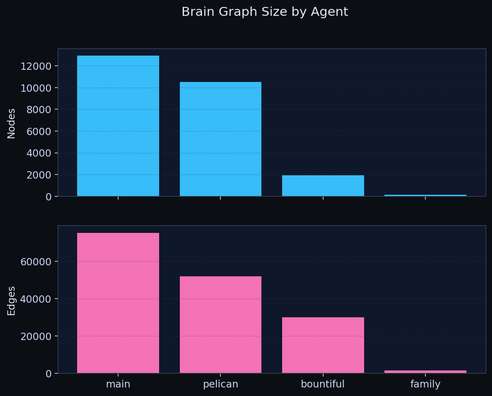
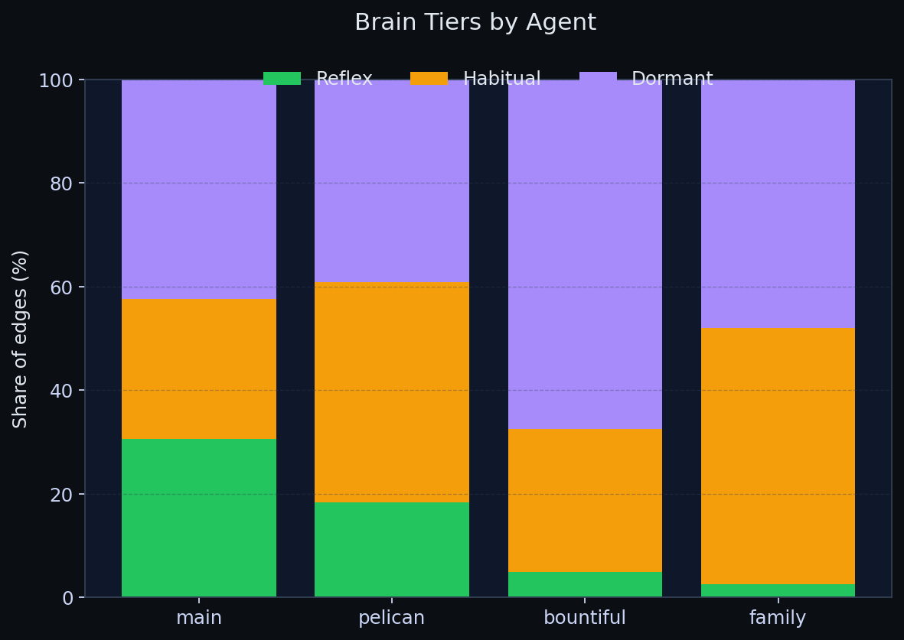
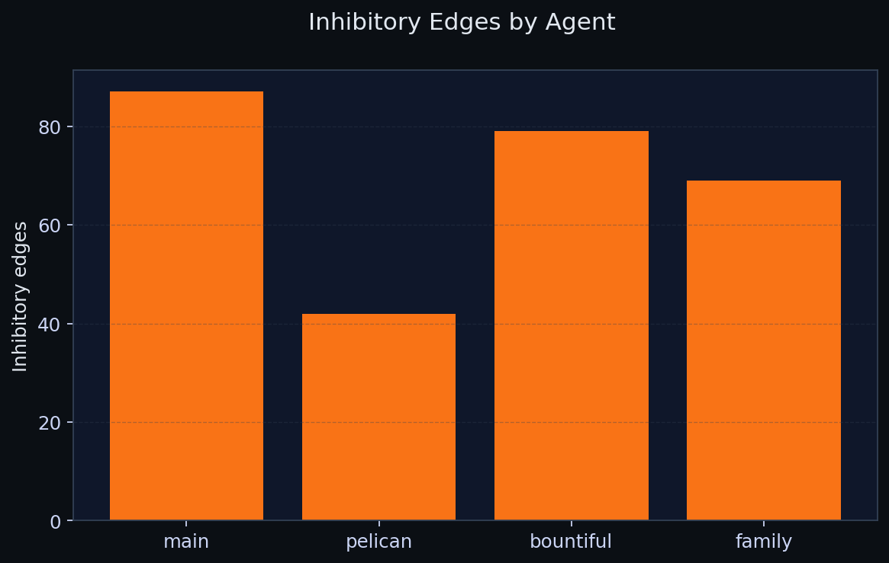

# Brains Dashboard

This dashboard summarizes per-agent brain graph size and edge composition for a single snapshot.

Snapshot date: **2026-03-03**.

## What the charts show
- **Nodes + edges:** Total nodes and edges in each agent's brain graph.
- **Tiers:** Percent share of edges that are reflex, habitual, or dormant.
- **Inhibitory edges:** Count of inhibitory edges per agent.

## Tier meanings (high level)
- **Reflex:** Fast, high-confidence edges that fire immediately for common or critical routes.
- **Habitual:** Stable, well-reinforced edges that represent consistent patterns.
- **Dormant:** Low-activation edges retained for long-tail or rarely used knowledge.

## Refreshing the snapshot
1. Edit the data table in `scripts/gen_brains_dashboard.py` with the latest snapshot.
2. Re-run `python3 scripts/gen_brains_dashboard.py` to regenerate the PNGs.

## Charts

